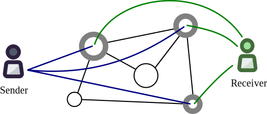

.. role:: bash(code)
   :language: bash

=========
pyUmbral
=========

.. start-badges

|version|  |circleci| |commits-since| |docs| |discord|

.. |docs| image:: https://readthedocs.org/projects/pyumbral/badge/?style=flat
    :target: https://readthedocs.org/projects/pyumbral
    :alt: Documentation Status

.. |discord| image:: https://img.shields.io/discord/411401661714792449.svg?logo=discord
    :target: https://discord.gg/xYqyEby
    :alt: Discord

.. |circleci| image:: https://img.shields.io/circleci/project/github/nucypher/pyUmbral.svg?logo=circleci
    :target: https://circleci.com/gh/nucypher/pyUmbral/tree/master
    :alt: CircleCI build status

.. |version| image:: https://img.shields.io/pypi/v/umbral.svg
    :alt: PyPI Package latest release
    :target: https://pypi.org/project/umbral

.. |commits-since| image:: https://img.shields.io/github/commits-since/nucypher/pyumbral/v0.1.3-alpha.2.svg
    :alt: Commits since latest release
    :target: https://github.com/nucypher/pyUmbral/compare/v0.1.3-alpha.2...master

.. end-badges

pyUmbral is the reference implementation of the Umbral_ threshold proxy re-encryption scheme.
It is open-source, built with Python, and uses OpenSSL_ and Cryptography.io_.

Using Umbral, Alice (the data owner) can *delegate decryption rights* to Bob for
any ciphertext intended to her, through a re-encryption process performed by a
set of semi-trusted proxies or *Ursulas*. When a threshold of these proxies
participate by performing re-encryption, Bob is able to combine these independent
re-encryptions and decrypt the original message using his private key.

pyUmbral is the cryptographic engine behind nucypher_,
a proxy re-encryption network to empower privacy in decentralized systems.

.. _Umbral: https://github.com/nucypher/umbral-doc/blob/master/umbral-doc.pdf
.. _Cryptography.io: https://cryptography.io/en/latest/
.. _OpenSSL: https://www.openssl.org/
.. _nucypher: https://github.com/nucypher/nucypher

Usage
=====

**Key Generation**

As in any public-key cryptosystem, users need a pair of public and private keys.
Additionally, users that delegate access to their data (like Alice, in this example) need a signing keypair.

.. code-block:: python

    from umbral import SecretKey, PublicKey

    # Generate Umbral keys for Alice.
    alices_secret_key = SecretKey.random()
    alices_public_key = PublicKey.from_secret_key(alices_secret_key)

    alices_signing_key = SecretKey.random()
    alices_verifying_key = PublicKey.from_secret_key(alices_signing_key)

    # Generate Umbral keys for Bob.
    bobs_secret_key = SecretKey.random()
    bobs_public_key = PublicKey.from_secret_key(bobs_secret_key)

**Encryption**

Now let's encrypt data with Alice's public key.
Invocation of ``pre.encrypt`` returns both the ``ciphertext`` and a ``capsule``.
Note that anyone with Alice's public key can perform this operation.

Since data was encrypted with Alice's public key,
Alice can open the capsule and decrypt the ciphertext with her private key.

.. code-block:: python

    from umbral import encrypt, decrypt_original

    # Encrypt data with Alice's public key.
    plaintext = b'Proxy Re-Encryption is cool!'
    capsule, ciphertext = encrypt(alices_public_key, plaintext)

    # Decrypt data with Alice's private key.
    cleartext = decrypt_original(alices_secret_key, capsule, ciphertext)

**Re-Encryption Key Fragments**

When Alice wants to grant Bob access to open her encrypted messages,
she creates *re-encryption key fragments*, or *"kfrags"*,
which are next sent to N proxies or *Ursulas*.

.. code-block:: python

    from umbral import generate_kfrags

    # Alice generates "M of N" re-encryption key fragments (or "KFrags") for Bob.
    # In this example, 10 out of 20.
    kfrags = generate_kfrags(delegating_sk=alices_secret_key,
                             receiving_pk=bobs_public_key,
                             signing_sk=alices_signing_key,
                             threshold=10,
                             num_kfrags=20)

**Re-Encryption**

Bob asks several Ursulas to re-encrypt the capsule so he can open it.
Each Ursula performs re-encryption on the capsule using the ``kfrag``
provided by Alice, obtaining this way a "capsule fragment", or ``cfrag``.

Bob collects the resulting cfrags from several Ursulas.
Bob must gather at least ``threshold`` cfrags in order to activate the capsule.

.. code-block:: python

    from umbral import reencrypt

    # Several Ursulas perform re-encryption, and Bob collects the resulting `cfrags`.
    cfrags = list()           # Bob's cfrag collection
    for kfrag in kfrags[:10]:
        cfrag = pre.reencrypt(capsule=capsule, kfrag=kfrag)
        cfrags.append(cfrag)    # Bob collects a cfrag

**Decryption by Bob**

Finally, Bob activates the capsule by attaching at least ``threshold`` cfrags,
and then decrypts the re-encrypted ciphertext.

.. code-block:: python

    from umbral import decrypt_reencrypted

    bob_cleartext = pre.decrypt_reencrypted(decrypting_sk=bobs_secret_key,
                                            delegating_pk=alices_public_key,
                                            capsule=capsule,
                                            cfrags=cfrags,
                                            ciphertext=ciphertext)
    assert bob_cleartext == plaintext

See more detailed usage examples in the docs_ directory.

.. _docs : https://github.com/nucypher/pyUmbral/tree/master/docs

Quick Installation
==================

To install pyUmbral, simply use ``pip``:

.. code-block:: bash

  $ pip3 install umbral

Alternatively, you can checkout the repo and install it from there.
The NuCypher team uses ``pipenv`` for managing pyUmbral's dependencies.
The recommended installation procedure is as follows:

.. code-block:: bash

    $ sudo pip3 install pipenv
    $ pipenv install

Post-installation, you can activate the project virtual environment
in your current terminal session by running ``pipenv shell``.

For more information on ``pipenv``, find the official documentation here: https://docs.pipenv.org/.

Academic Whitepaper
====================

The Umbral scheme academic whitepaper and cryptographic specifications
are available on GitHub_.

  "Umbral: A Threshold Proxy Re-Encryption Scheme"
  *by David Nuñez*.
  https://github.com/nucypher/umbral-doc/blob/master/umbral-doc.pdf

.. _GitHub: https://github.com/nucypher/umbral-doc/

Support & Contribute
=====================

- Issue Tracker: https://github.com/nucypher/pyUmbral/issues
- Source Code: https://github.com/nucypher/pyUmbral

Security
========

If you identify vulnerabilities with _any_ nucypher code,
please email security@nucypher.com with relevant information to your findings.
We will work with researchers to coordinate vulnerability disclosure between our partners
and users to ensure successful mitigation of vulnerabilities.

Throughout the reporting process,
we expect researchers to honor an embargo period that may vary depending on the severity of the disclosure.
This ensures that we have the opportunity to fix any issues, identify further issues (if any), and inform our users.

Sometimes vulnerabilities are of a more sensitive nature and require extra precautions.
We are happy to work together to use a more secure medium, such as Signal.
Email security@nucypher.com and we will coordinate a communication channel that we're both comfortable with.
