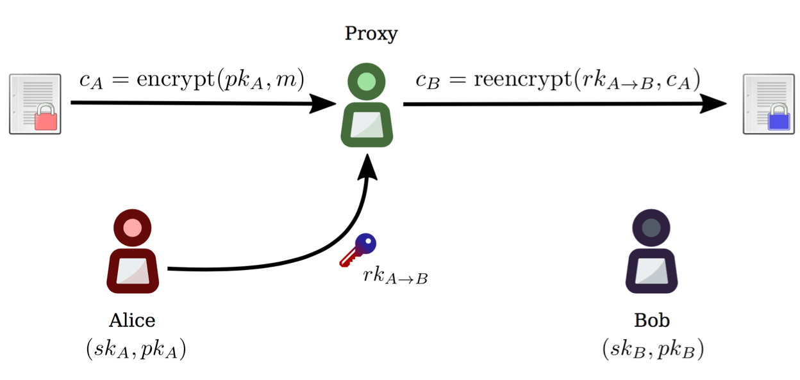

==============
Using pyUmbral
==============

.. testsetup:: capsule_story

    import sys
    import os
    sys.path.append(os.path.abspath(os.getcwd()))

.. testcleanup:: capsule_story

    from umbral import config
    config._CONFIG.___CONFIG__curve = None
    config._CONFIG.___CONFIG__params = None

Configuration
==============

Setting the default curve
--------------------------

The best way to start using pyUmbral is to decide on an elliptic curve to use and set it as your default.

.. doctest:: capsule_story

    >>> from umbral import config
    >>> from umbral.curve import SECP256K1
    >>> config.set_default_curve(SECP256K1)

For more information on curves, see :doc:`choosing_and_using_curves`.

Encryption
==========

Generate an Umbral key pair
-----------------------------
First, let's generate two asymmetric key pairs for Alice:
A delegating key pair and a signing key pair.

.. doctest:: capsule_story

    >>> from umbral import keys, signing

    >>> alices_private_key = keys.UmbralPrivateKey.gen_key()
    >>> alices_public_key = alices_private_key.get_pubkey()

    >>> alices_signing_key = keys.UmbralPrivateKey.gen_key()
    >>> alices_verifying_key = alices_signing_key.get_pubkey()
    >>> alices_signer = signing.Signer(private_key=alices_signing_key)

Encrypt with a public key
--------------------------
Now let's encrypt data with Alice's public key.
Invocation of ``pre.encrypt`` returns both the ``ciphertext`` and a ``capsule``.
Note that anyone with Alice's public key can perform this operation.

.. doctest:: capsule_story

    >>> from umbral import pre
    >>> plaintext = b'Proxy Re-encryption is cool!'
    >>> ciphertext, capsule = pre.encrypt(alices_public_key, plaintext)

Decrypt with a private key
---------------------------
Since data was encrypted with Alice's public key,
Alice can open the capsule and decrypt the ciphertext with her private key.

.. doctest:: capsule_story

    >>> cleartext = pre.decrypt(ciphertext=ciphertext,
    ...                         capsule=capsule,
    ...                         decrypting_key=alices_private_key)

Threshold Re-Encryption
==================================

Bob Exists
-----------

.. doctest:: capsule_story

    >>> from umbral import keys
    >>> bobs_private_key = keys.UmbralPrivateKey.gen_key()
    >>> bobs_public_key = bobs_private_key.get_pubkey()

Alice grants access to Bob by generating kfrags 
-----------------------------------------------
When Alice wants to grant Bob access to open her encrypted messages, 
she creates *re-encryption key fragments*, or *"kfrags"*,
which are next sent to N proxies or *Ursulas*.

Alice must specify ``N`` (the total number of kfrags),
and a ``threshold`` (the minimum number of kfrags needed to activate a capsule).
In the following example, Alice creates 20 kfrags,
but Bob needs to get only 10 re-encryptions to activate the capsule.

.. doctest:: capsule_story

    >>> kfrags = pre.generate_kfrags(delegating_privkey=alices_private_key,
    ...                              signer=alices_signer,
    ...                              receiving_pubkey=bobs_public_key,
    ...                              threshold=10,
    ...                              N=20)

Bob receives a capsule
-----------------------
Next, let's generate a key pair for Bob, and pretend to send
him the capsule through a side channel like
S3, IPFS, Google Cloud, Sneakernet, etc.

.. code-block:: python

   # Bob receives the capsule through a side-channel: IPFS, Sneakernet, etc.
   capsule = <fetch the capsule through a side-channel>

Bob fails to open the capsule
-------------------------------
If Bob attempts to open a capsule that was not encrypted for his public key,
or re-encrypted for him by Ursula, he will not be able to open it.

.. doctest:: capsule_story

    >>> fail = pre.decrypt(ciphertext=ciphertext,
    ...                    capsule=capsule,
    ...                    decrypting_key=bobs_private_key)
    Traceback (most recent call last):
        ...
    umbral.pre.UmbralDecryptionError

Ursulas perform re-encryption
------------------------------
Bob asks several Ursulas to re-encrypt the capsule so he can open it. 
Each Ursula performs re-encryption on the capsule using the ``kfrag``
provided by Alice, obtaining this way a "capsule fragment", or ``cfrag``.
Let's mock a network or transport layer by sampling ``threshold`` random kfrags,
one for each required Ursula. Note that each Ursula must prepare the received 
capsule before re-encryption by setting the proper correctness keys.

Bob collects the resulting cfrags from several Ursulas.
Bob must gather at least ``threshold`` cfrags in order to activate the capsule.

.. doctest:: capsule_story

    >>> import random
    >>> kfrags = random.sample(kfrags,  # All kfrags from above
    ...                        10)      # M - Threshold

    >>> capsule.set_correctness_keys(delegating=alices_public_key,
    ...                              receiving=bobs_public_key,
    ...                              verifying=alices_verifying_key)
    (True, True, True)

    >>> cfrags = list()                 # Bob's cfrag collection
    >>> for kfrag in kfrags:
    ...     cfrag = pre.reencrypt(kfrag=kfrag, capsule=capsule)
    ...     cfrags.append(cfrag)        # Bob collects a cfrag

.. doctest:: capsule_story
   :hide:

    >>> assert len(cfrags) == 10

Decryption
==================================

Bob attaches cfrags to the capsule
----------------------------------
Bob attaches at least ``threshold`` cfrags to the capsule,
which has to be prepared in advance with the necessary correctness keys. 
Only then it can become *activated*.

.. doctest:: capsule_story

    >>> capsule.set_correctness_keys(delegating=alices_public_key,
    ...                              receiving=bobs_public_key,
    ...                              verifying=alices_verifying_key)
    (False, False, False)

    >>> for cfrag in cfrags:
    ...     capsule.attach_cfrag(cfrag)

Bob activates and opens the capsule
------------------------------------
Finally, Bob decrypts the re-encrypted ciphertext using the activated capsule.

.. doctest:: capsule_story

    >>> cleartext = pre.decrypt(ciphertext=ciphertext,
    ...                         capsule=capsule,
    ...                         decrypting_key=bobs_private_key)

.. doctest:: capsule_story
   :hide:

    >>> assert cleartext == plaintext
